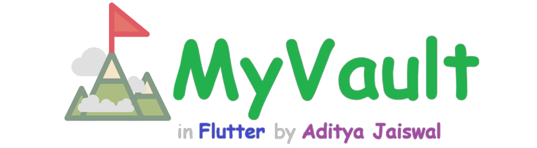
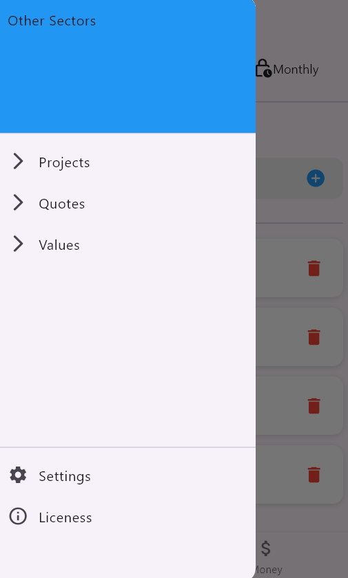
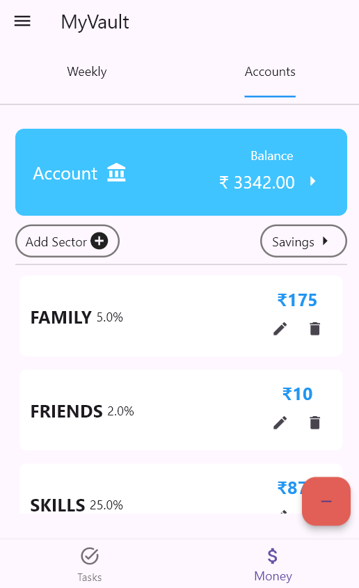
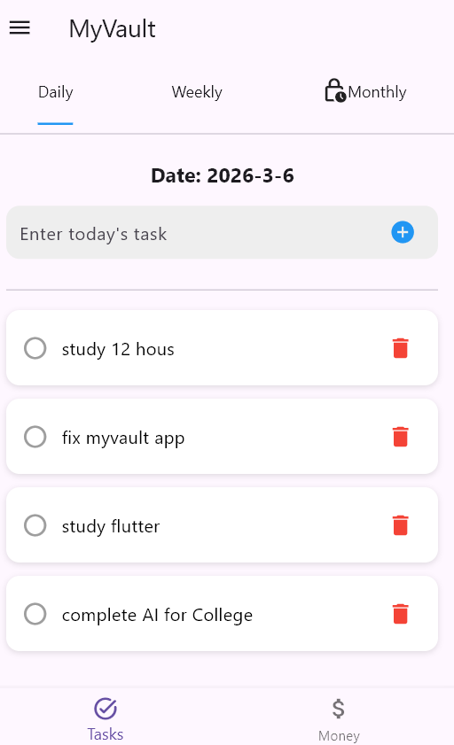
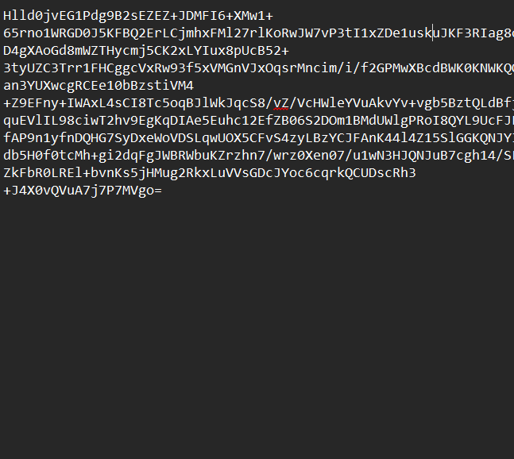
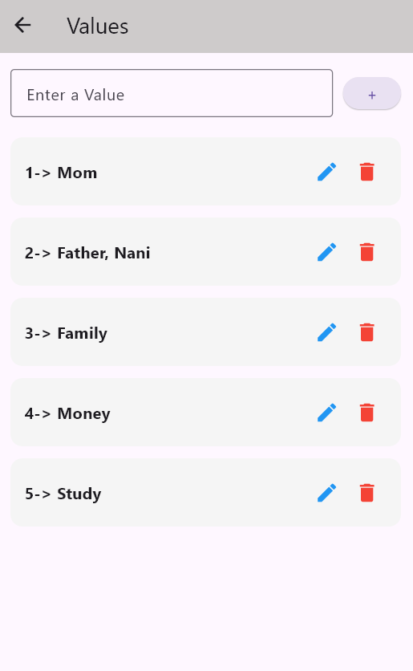
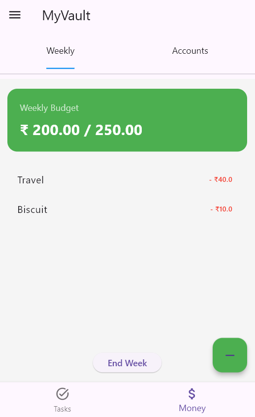

# MyVault

MyVault is a personal productivity and management app built using **Flutter**.
It helps users organize important parts of daily life like **accounts, tasks, projects, budgets, and personal values** in one place.

This project was developed as a **personal learning and productivity tool**.

---

## App Banner

At the top of the README, the app displays a **background banner that contains the MyVault logo and the app name**.



---

# Features

### Dashboard

A central place to quickly navigate to some sections of the app.



---

### Accounts

Manage and view account-related information.



---

### Daily Tasks

Track and manage your daily tasks.



---

### Data Form

The form in which the data is stored



---

### Projects

Create and manage different personal or work projects by adding tech stack and start/end date.


---

### Values

Store and track personal values or important metrics.



---

### Weekly Budget

Track your weekly budget and expenses.



---

# Built With

- Flutter
- Dart
- Local File Storage (JSON)
- Material UI
- AES Encryption Method

---

# Installation

1. Clone the repository

```
git clone https://github.com/aj-aditya19/MyVault.git
```

2. Go to the project directory

```
cd MyVault
```

3. Install dependencies

```
flutter pub get
```

4. Run the app

```
flutter run
```

---

# APK Build

To generate a release APK:

```
flutter build apk --release
```

APK will be generated in:

```
build/app/outputs/flutter-apk/app-release.apk
```

---

# Future Improvements

- PIN Lock for secure access to prevent some personal screens
- UI improvements and Dark Mode
- More featuers like AI, Day Conclusion, Monthly Tasks, Yearly Tasks

---

# Author

Aditya Jaiswal

GitHub:
https://github.com/aj-aditya19

---

# License

This project is open source and available under the **Mona-AJ**.
