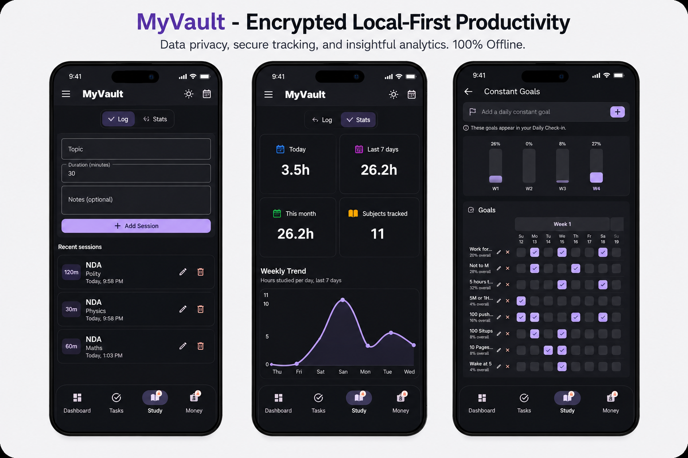

# MyVault

A private, local-first personal productivity system built with **Flutter**, combining secure local storage with **Firebase authentication and cloud synchronization**.

[](https://flutter.dev/)
[](https://dart.dev/)
[](https://firebase.google.com/)

> Organize your accounts, tasks, projects, budgets, and personal values in one place — with encrypted local storage and optional cross-device synchronization.

---

## App Preview



---

## Features

### Dashboard

Central hub for navigating all modules of the app in one place.

### Statistics

Visualize productivity and study habits over time.

- Total tracked days and study hours
- Best performance day
- Best performance day tracking
- Activity trends from saved data

### Accounts

Securely store and manage account-related information.

- Local encrypted storage
- Firebase Authentication
- Account synchronization across devices

### Daily Tasks

Create, track, and complete daily tasks efficiently.

- Add and manage tasks
- Mark tasks as completed
- Persist task data locally
- Synchronize changes when Firebase sync is enabled

### Data Form

Structured forms for saving and organizing personal information securely.

### Projects

Plan and manage personal or professional projects.

- Project details
- Technology stack
- Start and end dates
- Progress tracking
- Local persistence and synchronization

### Values

Record and reflect on personal goals, habits, and principles.

### Weekly Budget

Track expenses and manage weekly financial goals.

---

## Firebase & Cloud Sync

MyVault uses **Firebase for authentication and cloud synchronization** while maintaining a local-first architecture.

### Firebase Features

- Firebase Authentication
- Email/password account creation and login
- Cloud Firestore
- Cross-device data synchronization
- Remote data retrieval
- Synchronization when connectivity is available

### Sync Architecture

```text
Local MyVault Data
        │
        ▼
Encrypted Local Storage
        │
        ├── Offline ──────────────► Continue working locally
        │
        └── Internet Available
                    │
                    ▼
              Firebase Auth
                    │
                    ▼
             Cloud Firestore
                    │
                    ▼
          Synchronize User Data
```

The application is designed to remain usable when offline. Synchronization is performed when Firebase is available and the user is authenticated.

---

## Privacy & Security

| Feature        | Detail                       |
| -------------- | ---------------------------- |
| Local Storage  | JSON-based local storage     |
| Encryption     | AES encryption               |
| Authentication | Firebase Authentication      |
| Cloud Database | Firebase Cloud Firestore     |
| Sync           | Cross-device synchronization |
| Tracking       | No application tracking      |
| Offline Usage  | Supported                    |

> **Local-first:** The application keeps working with locally stored data when an internet connection is unavailable. When synchronization is available, user data can be synchronized through Firebase.

---

## Tech Stack

| Layer            | Technology               |
| ---------------- | ------------------------ |
| Framework        | Flutter                  |
| Language         | Dart                     |
| UI               | Material Design          |
| Local Storage    | Local JSON files         |
| Encryption       | AES                      |
| Authentication   | Firebase Authentication  |
| Cloud Database   | Firebase Cloud Firestore |
| Connectivity     | `connectivity_plus`      |
| State Management | Provider                 |

---

## Getting Started

### Prerequisites

- Flutter SDK
- Dart SDK
- Android Studio
- VS Code (optional)
- Firebase project configured for the application

Check your Flutter environment:

```bash
flutter doctor
```

### Installation

```bash
git clone https://github.com/aj-aditya19/MyVault.git

cd MyVault

flutter pub get

flutter run
```

---

## Firebase Configuration

MyVault uses Firebase for authentication and synchronization.

Before running the application with Firebase functionality:

1. Create or configure a Firebase project.
2. Configure Firebase for the required platforms.
3. Configure the application's Firebase options.
4. Configure the required environment variables.
5. Enable Firebase Authentication.
6. Configure Cloud Firestore and its security rules.

The project uses environment-based Firebase API configuration instead of directly storing API keys in application source code.

---

## Environment Variables

Create a `.env` file in the project root and provide the Firebase configuration values required by the application.

Example:

```env
FIREBASE_WEB_API_KEY=your_web_api_key
FIREBASE_ANDROID_API_KEY=your_android_api_key
FIREBASE_IOS_API_KEY=your_ios_api_key
FIREBASE_WINDOWS_API_KEY=your_windows_api_key
```

Do **not** commit your `.env` file.

Add it to `.gitignore`:

```gitignore
.env
```

> Firebase API keys are configuration identifiers, not passwords. Firebase Authentication settings and Firestore Security Rules must still be configured correctly to protect user data.

---

## Build Instructions

### Android APK

```bash
flutter build apk --release
```

Output:

```text
build/app/outputs/flutter-apk/app-release.apk
```

### Windows Desktop

```bash
flutter config --enable-windows-desktop
flutter build windows
```

Output:

```text
build/windows/x64/runner/Release/app.exe
```

---

## Project Structure

```text
MyVault/
├── android/
├── ios/
├── windows/
├── lib/
│   ├── core/
│   ├── ...
│   ├── firebase_options.dart
│   └── main.dart
├── assets/
├── pubspec.yaml
├── .env
└── README.md
```

---

## Roadmap

- PIN lock / biometric authentication
- Dark mode UI
- Monthly and yearly productivity views
- Advanced analytics in Statistics
- AI-based productivity insights
- Improved synchronization and conflict resolution
- Additional platform support

---

## Platform Support

| Platform | Status         |
| -------- | -------------- |
| Android  | Supported      |
| Windows  | Supported      |
| iOS      | Not configured |
| Web      | Not configured |

---

## Author

**Aditya Jaiswal**

GitHub: [aj-aditya19](https://github.com/aj-aditya19)

---

## License

**Mona-AJ License**

Free for learning and personal use. Commercial use requires permission.
