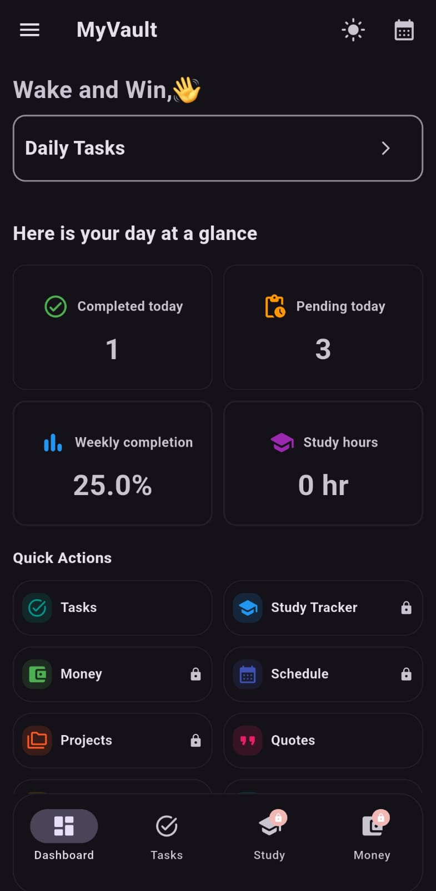
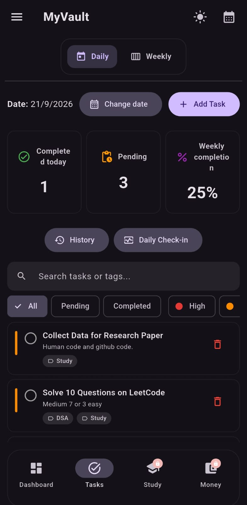
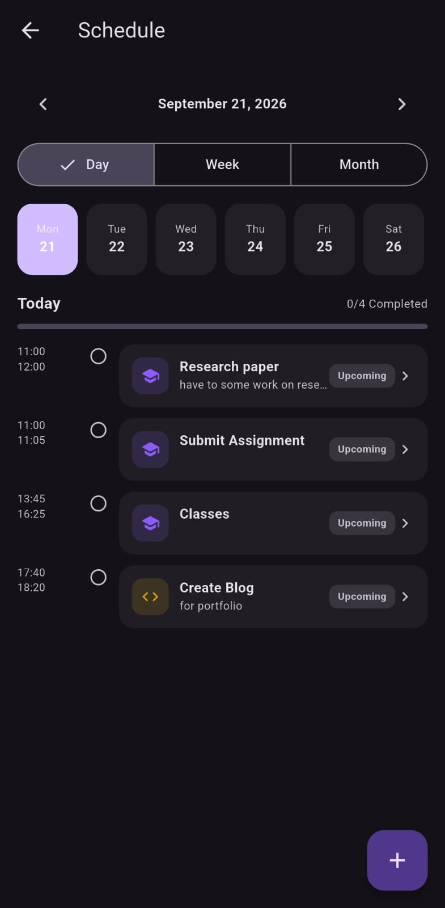
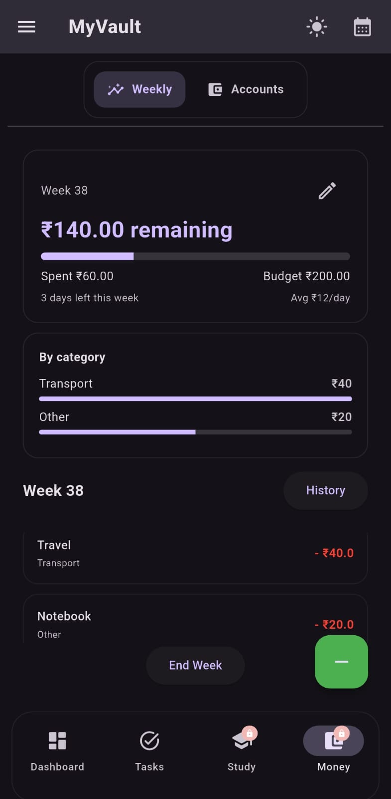
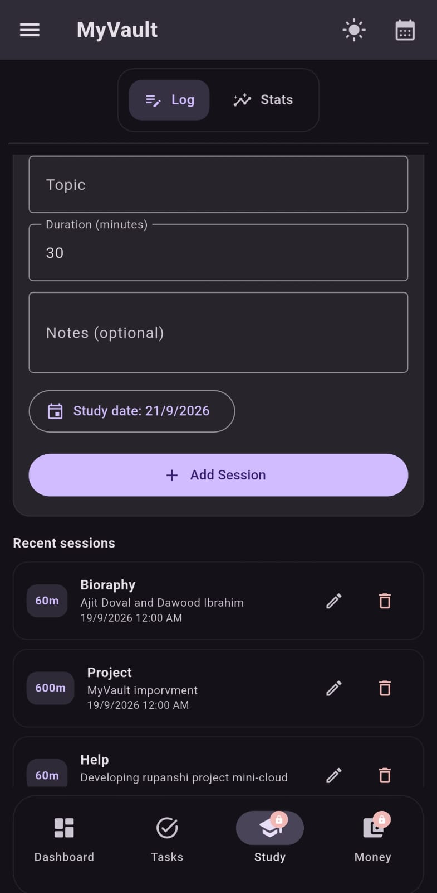
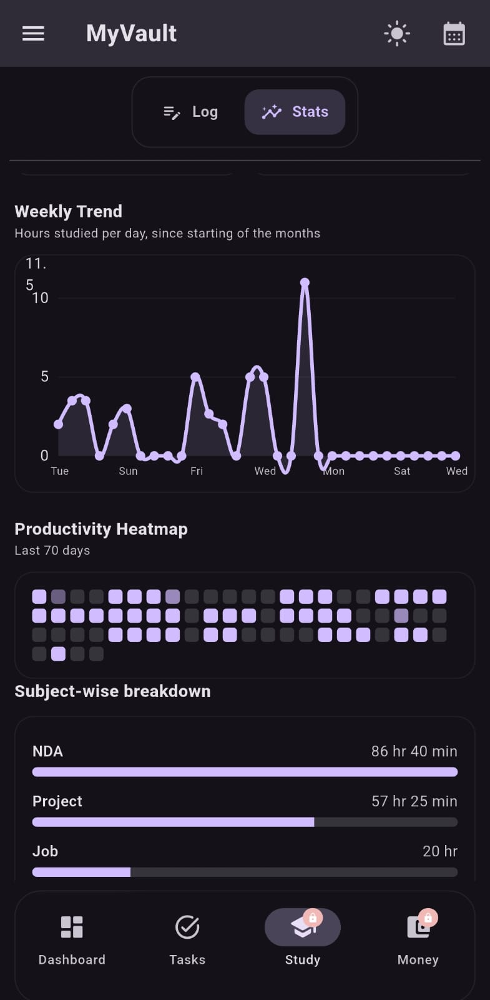
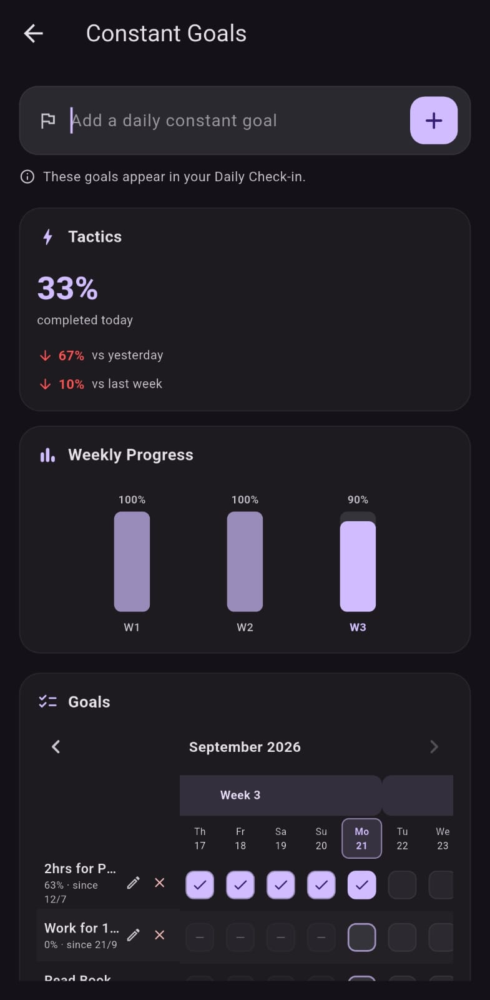
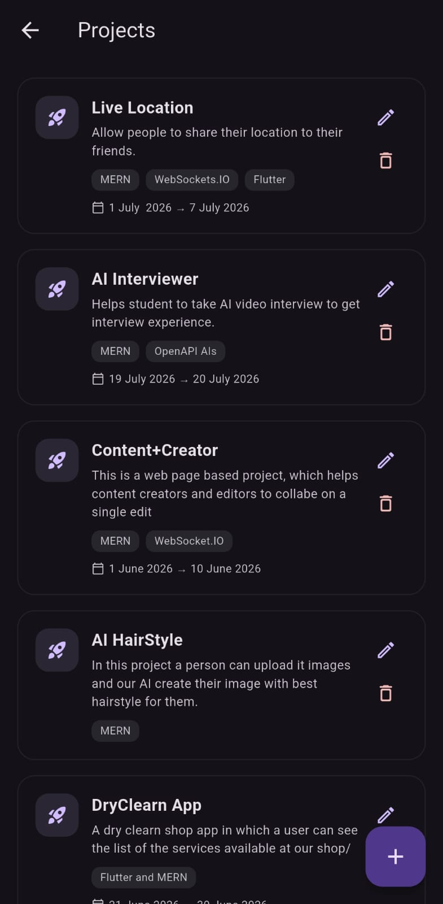
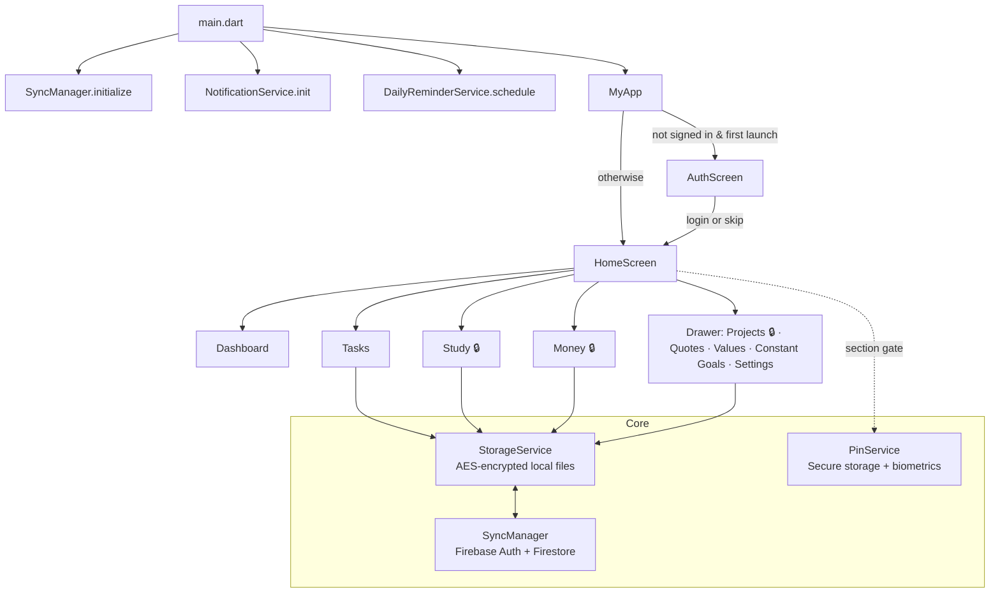
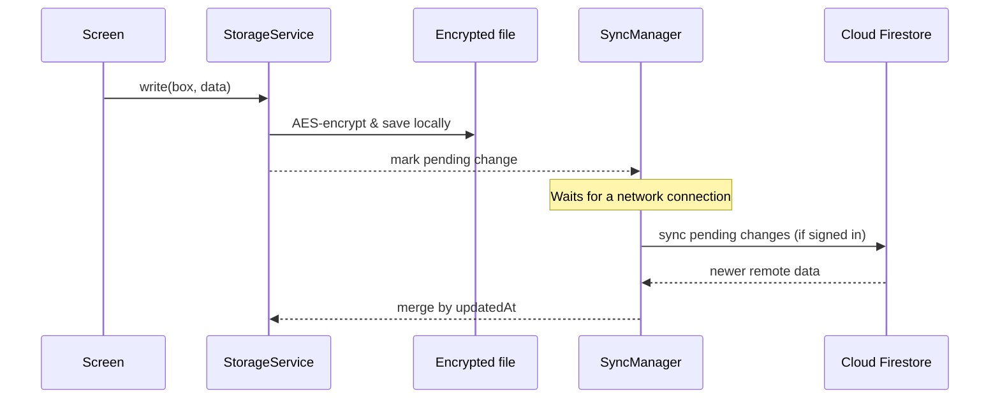

<div align="center">


<a href="https://github.com/aj-aditya19/MyVault">
  
</a>

<br/>


[](LICENSE)
[](https://github.com/aj-aditya19/MyVault/stargazers)
[](https://github.com/aj-aditya19/MyVault/network/members)
[](https://github.com/aj-aditya19/MyVault/issues)


<br/>

[✨ Features](#features) •
[📸 Screenshots](#screenshots) •
[🏗️ Architecture](#architecture) •
[🚀 Getting Started](#getting-started) •
[🔐 Security](#security--privacy) •
[🤝 Contributing](#contributing)

</div>

---

## About

**MyVault** is a personal productivity super-app that puts your daily tasks, study sessions, spending, schedule, projects and motivation in **one secure place**.

It's built **offline-first**: everything works without an account or internet connection, is stored encrypted on your device, and optionally syncs to the cloud when you sign in.

> 💡 _"Small steps count. Set one task and one budget for today, then make it happen."_

---

## Features

<table>
<tr>
<td width="50%" valign="top">

### Smart Dashboard

- "Your day at a glance" overview
- Completed vs. pending tasks today
- Weekly completion & study-hours summary
- Quick actions to jump anywhere
- Daily motivation messages

### Tasks & Habits

- **Daily** and **Weekly** task lists with history
- **High / Medium / Low** priority colour-coding
- **Constant Goals** — habits tracked with _vs yesterday_ and _vs last week_ comparisons
- **Daily Check-in** — achievement, mistakes/loss, exercise minutes, study hours & notes

### Study Tracker

- Log sessions by **subject**, **topic** and **duration**
- Study statistics and progress charts

</td>
<td width="50%" valign="top">

### Money Manager

- **Weekly budget** with editable limits
- Spending **by category** — Bills, Shopping, Transport, Entertainment, General, Other
- Accounts, savings and full money history
- **Expense capture** — a quick _"Did you spend ₹X on …?"_ prompt to log in seconds

### Schedule

- **Week** and **Month** calendar views
- Categories: Study · Project · Personal · Fitness · Other
- Automatic reminders **2 hours, 1 hour and 15 minutes** before events

### Personal Growth

- **Projects** — track what you're building
- **Values** — write down what you stand for
- **Quotes** — keep the words that keep you going
- **Statistics** — charts powered by `fl_chart`

</td>
</tr>
</table>

### Plus…

|                          |                                                                                                    |
| ------------------------ | -------------------------------------------------------------------------------------------------- |
| **Smart reminders**      | Scheduled daily notifications for Tasks, Money and Schedule, each with a random motivation message |
| **PIN + Biometric lock** | Protects Study, Money, Schedule and Projects                                                       |
| **Optional cloud sync**  | Sign in with Firebase to sync across devices — or just skip and use it locally                     |
| **Light & Dark themes**  | Material 3 with a teal seed colour, switchable on the fly                                          |
| **Responsive layout**    | Bottom navigation on phones, side navigation and width-capped content on tablets/desktop           |

---

## Screenshots

<div align="center">

<table>
  <tr>
    <th align="center">Dashboard</th>
    <th align="center">Tasks</th>
    <th align="center">Schedule</th>
    <th align="center">Money</th>
  </tr>
  <tr>
    <td align="center"></td>
    <td align="center"></td>
    <td align="center"></td>
    <td align="center"></td>
  </tr>
</table>

<table>
  <tr>
    <th align="center">Study</th>
    <th align="center">Statistics</th>
    <th align="center">Constant Goals</th>
    <th align="center">Projects</th>
  </tr>
  <tr>
    <td align="center"></td>
    <td align="center"></td>
    <td align="center"></td>
    <td align="center"></td>
  </tr>
</table>

</div>

---

## Architecture

MyVault follows a simple **feature-first** structure with a shared `core` layer for models, services and widgets.


```mermaid
flowchart TD
    A[main.dart] --> B[SyncManager.initialize]
    A --> C[NotificationService.init]
    A --> D[DailyReminderService.schedule]
    A --> E[MyApp]
    E -->|not signed in & first launch| F[AuthScreen]
    E -->|otherwise| G[HomeScreen]
    F -->|login or skip| G
    G --> H[Dashboard]
    G --> I[Tasks]
    G --> J[Study 🔒]
    G --> K[Money 🔒]
    G --> L[Drawer: Projects 🔒 · Quotes · Values · Constant Goals · Settings]

    subgraph Core
        S[StorageService<br/>AES-encrypted local files]
        M[SyncManager<br/>Firebase Auth + Firestore]
        P[PinService<br/>Secure storage + biometrics]
    end

    I & J & K & L --> S
    S <--> M
    G -.->|section gate| P
```

### How data flows


```mermaid
sequenceDiagram
    participant UI as Screen
    participant SS as StorageService
    participant FS as Encrypted file
    participant SM as SyncManager
    participant CL as Cloud Firestore

    UI->>SS: write(box, data)
    SS->>FS: AES-encrypt & save locally
    SS-->>SM: mark pending change
    Note over SM: Waits for a network connection
    SM->>CL: sync pending changes (if signed in)
    CL-->>SM: newer remote data
    SM-->>SS: merge by updatedAt
```

### Project structure

```text
app/lib/
├── main.dart                  # App bootstrap
├── myapp.dart                 # Theme, auth gate & lifecycle handling
├── firebase_options.dart      # Firebase config (keys loaded from .env)
│
├── core/
│   ├── models/                # Task, StudySession, ScheduleEvent, categories
│   ├── services/
│   │   ├── storage_service.dart          # Encrypted local storage
│   │   ├── sync_manager.dart             # Firebase auth + cloud sync
│   │   ├── pin_service.dart              # PIN & biometric unlock
│   │   ├── notification_service.dart     # Local notifications
│   │   ├── daily_reminder_service.dart   # Scheduled reminders
│   │   ├── expense_capture_service.dart  # Quick expense logging
│   │   └── motivation_service.dart       # Random motivation messages
│   ├── utils/responsive.dart  # Phone / tablet / desktop breakpoints
│   └── widgets/               # Shared widgets + PIN gate
│
├── Screens/
│   ├── Auth/                  # Login · sign-up · password reset
│   ├── Dashboard/             # Daily overview
│   ├── Task/                  # Daily · weekly · history · check-in · constant goals
│   ├── Study/                 # Session log & stats
│   ├── Money/                 # Weekly budget · accounts · savings · history
│   ├── Schedule/              # Week & month calendar
│   ├── Project/  Quotes/  Values/  Statistics/
│   └── home_screen.dart       # Navigation shell
│
├── Other/                     # AppBar · Drawer · NavigateBar · Settings · Licenses
└── theme/app_theme.dart       # Light & dark Material 3 themes
```

---

## Tech Stack

| Layer             | Technology                                                                                                                                                                                                |
| ----------------- | --------------------------------------------------------------------------------------------------------------------------------------------------------------------------------------------------------- |
| **Framework**     | [Flutter](https://flutter.dev) · Dart                                                                                                                                                                     |
| **State**         | [`provider`](https://pub.dev/packages/provider)                                                                                                                                                           |
| **Auth & Cloud**  | [`firebase_auth`](https://pub.dev/packages/firebase_auth) · [`cloud_firestore`](https://pub.dev/packages/cloud_firestore) · [`firebase_core`](https://pub.dev/packages/firebase_core)                     |
| **Local storage** | [`path_provider`](https://pub.dev/packages/path_provider) + [`encrypt`](https://pub.dev/packages/encrypt) (AES)                                                                                           |
| **Security**      | [`flutter_secure_storage`](https://pub.dev/packages/flutter_secure_storage) · [`local_auth`](https://pub.dev/packages/local_auth)                                                                         |
| **Notifications** | [`flutter_local_notifications`](https://pub.dev/packages/flutter_local_notifications) · [`timezone`](https://pub.dev/packages/timezone) · [`flutter_timezone`](https://pub.dev/packages/flutter_timezone) |
| **Charts**        | [`fl_chart`](https://pub.dev/packages/fl_chart)                                                                                                                                                           |
| **Connectivity**  | [`connectivity_plus`](https://pub.dev/packages/connectivity_plus)                                                                                                                                         |
| **Config**        | [`flutter_dotenv`](https://pub.dev/packages/flutter_dotenv)                                                                                                                                               |
| **Utilities**     | [`uuid`](https://pub.dev/packages/uuid)                                                                                                                                                                   |

---

## Getting Started

### Prerequisites

- [Flutter SDK](https://docs.flutter.dev/get-started/install) (stable channel)
- A [Firebase project](https://console.firebase.google.com) _(only needed for account sign-in & sync)_
- Android Studio / Xcode / VS Code with the Flutter extension

### 1. Clone the repo

```bash
git clone https://github.com/aj-aditya19/MyVault.git
cd MyVault/app
```

> The Flutter project lives in the `app/` folder, so run every command below from inside it.

### 2. Install dependencies

```bash
flutter pub get
```

### 3. Create your `.env` file

Create a `.env` file inside the `app/` folder (next to `pubspec.yaml`) and list it under `assets:` in `pubspec.yaml` (the app calls `dotenv.load(fileName: '.env')` at startup):

```env
FIREBASE_WEB_API_KEY=your_web_api_key
FIREBASE_ANDROID_API_KEY=your_android_api_key
FIREBASE_IOS_API_KEY=your_ios_api_key        # also used for macOS
FIREBASE_WINDOWS_API_KEY=your_windows_api_key
```

You only need the key for the platform you're building for, but the app reads it with `!`, so a missing key on that platform will crash at startup.

You'll also need the motivation-messages asset declared in `pubspec.yaml`:

```yaml
flutter:
  assets:
    - .env
    - assets/data/motivation_messages.json
```

> Never commit your `.env` file — add it to `.gitignore`.

### 4. Set up Firebase

1. Create a Firebase project and enable **Authentication → Email/Password**.
2. Create a **Cloud Firestore** database.
3. Register your Android / iOS / Web (and macOS / Windows if needed) apps and update [`app/lib/firebase_options.dart`](app/lib/firebase_options.dart) (or run `flutterfire configure`).

### 5. Run it

```bash
flutter run
```

<details>
<summary><b>Build release versions</b></summary>

```bash
flutter build apk --release        # Android APK
flutter build appbundle --release  # Play Store bundle
flutter build ios --release        # iOS
flutter build web --release        # Web
```

</details>

---

## Security & Privacy

- **Encrypted at rest** — all local data is AES-encrypted, with a fresh random IV for every write.
- **PIN & biometrics** — sensitive sections (Study, Money, Schedule, Projects) stay locked until you authenticate. The PIN is kept in the platform's secure storage (Keychain / Keystore).
- **Works without an account** — nothing leaves your device unless you choose to sign in.
- **Safe password resets** — handled by Firebase's own mail system, so no email credentials are ever embedded in the app.

---

## Roadmap

- [x] Daily & weekly tasks with history
- [x] Constant goals & daily check-ins
- [x] Study session tracking
- [x] Weekly budgets & expense capture
- [x] Schedule with smart reminders
- [x] PIN + biometric protection
- [x] Optional Firebase sync
- [ ] Home-screen widgets
- [ ] Data export (CSV / PDF)
- [ ] Recurring events & tasks
- [ ] Localisation

Have an idea? [Open an issue](https://github.com/aj-aditya19/MyVault/issues/new) 💡

---

## Contributing

Contributions are welcome!

1. **Fork** the repository
2. Create your feature branch — `git checkout -b feature/amazing-feature`
3. Commit your changes — `git commit -m "Add amazing feature"`
4. Push to the branch — `git push origin feature/amazing-feature`
5. Open a **Pull Request**

---

## License

Distributed under the **MIT License**. See [`LICENSE`](LICENSE) for more information.

---

## Star History

<div align="center">

<a href="https://star-history.com/#aj-aditya19/MyVault&Date">
  <picture>
    <source media="(prefers-color-scheme: dark)" srcset="https://api.star-history.com/svg?repos=aj-aditya19/MyVault&type=Date&theme=dark" />
    <source media="(prefers-color-scheme: light)" srcset="https://api.star-history.com/svg?repos=aj-aditya19/MyVault&type=Date" />
    
  </picture>
</a>

<br/><br/>

### Made with 💙 and Flutter by [@aj-aditya19](https://github.com/aj-aditya19)

**If MyVault helps you stay on track, please consider giving it a ⭐ — it really helps!**


</div>
